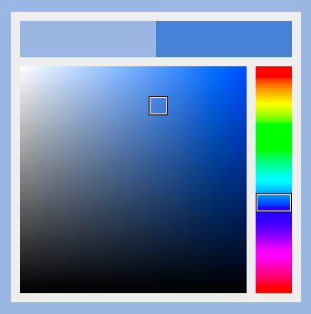

Color Picker
------------

Javascript Hue Saturation Value color picker that doesn't use any image assets. It is made to work with HTML canvas elements, so it works primarily with RGB arrays with values between 0 and 255 like this: [255, 127, 0].

Files
-----
	
	Include These:
		css/color_picker.css
		js/color_picker.js
	
	Usage Example:
		color_picker.html

To Do
-----

- Add touch support.

License
-------
Copyright Erik Wrenholt 2015
MIT License